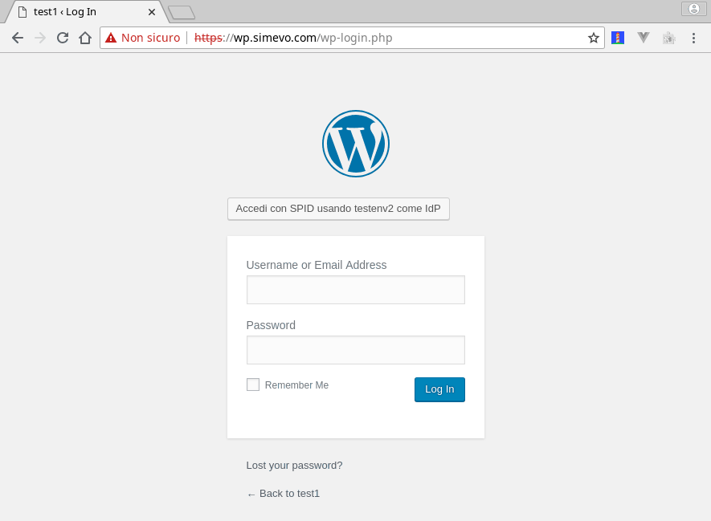

[](https://developersitalia.slack.com/messages/C7ESTBB98)
[](https://slack.developers.italia.it/)
[](https://forum.italia.it/c/spid)
[](https://travis-ci.com/simevo/spid-wordpress)

> ⚠️ **WORK IN PROGRESS** ⚠️

# spid-wordpress

**Plugin WordPress** per l'autenticazione attraverso un Identity Provider **SPID** (Sistema Pubblico di Identità Digitale) basato sulla libreria SPID PHP [italia/spid-php-lib](https://github.com/italia/spid-php-lib).

[SPID](https://www.spid.gov.it/), il Sistema Pubblico di Identità Digitale, è la soluzione che permette ai cittadini di accedere a tutti i servizi online della Pubblica Amministrazione con un'unica Identità Digitale (username e password) utilizzabile da computer, tablet e smartphone.

Questo plugin integra il login SPID in WordPress, offrendo le seguenti funzionalità:
- completamente configurabile
- generazione del metadata del Service Provider (SP)
- creazione automatica un utente WordPress distinto per ogni utente SPID che accede, e acquisizione dell'indirizzo email dell'utente da SPID
- possibilità di acquisire altri attributi (codice fiscale, data di nascita ...) se richiesto
- predisposizione per il testing con l'Identity Provider di test [spid-testenv2](https://github.com/italia/spid-testenv2).

Compatibile con:
- WordPress 4.9.8
- PHP 7.0, 7.1 e 7.2
- Solo WP single-site (no multi-site).

**Attenzione alla GDPR!**

> Quando il plugin è attivo, in base alle impostazioni, esso può salvare certi *dati personali* degli utenti SPID nel database WordPress.
>
> Si tratta degli attributi utente da richiedere a SPID: due sono indispensabili al funzionamento del plugin (codice identificativo SPID e indirizzo di posta elettronica), gli altri (es. il codice fiscale, la data di nascita, il sesso etc.) possono essere impostati nella sezione "Metadata" di SPID Opzioni.
>
> Più attributi SPID si richiedono più aumentano i rischi e la complessità della gestione di questi *dati personali* dal punto di vista della GDPR (Regolamento generale sulla protezione dei dati, in inglese General Data Protection Regulation).
>
> Il plugin acquisisce il *valido consenso* ai sensi della GDPR, tuttavia restano in carico al Service Provider:
> - la sicurezza dell'installazione WordPress
> - la gestione delle richieste da parte degli utenti di accesso e cancellazione dei dati
> - la notifica delle violazioni dei dati
> - e la pubblicazione dell'informativa per gli utenti su fini e modalità del trattamento dei dati personali.

## Per iniziare

Testato su: amd64 Debian 9.5 (stretch, current stable) con PHP 7.0.

### Installazione e configurazione

Per usare questo plugin, occorre:

1. Un'installazione WordPress funzionante

2. Installarlo, attivarlo, e configurarlo completamente usando la pagina di impostazioni.

3. (**OPZIONALE**) Generare chiave (`wp.key`) e certificato (`wp.crt`) del Service Provider (SP) nella directory `{WordPress root}/spid-conf/`, ad esempio:
    ```sh
    cd /var/www/html/wp-content/plugins/spid-wordpress
    mkdir -p spid-conf
    cd spid-conf
    openssl req -x509 -nodes -sha256 -days 365 -newkey rsa:2048 -subj "/C=IT/ST=Italy/L=Milan/O=myservice/CN=localhost" -keyout wp.key -out wp.crt
    chown www-data:www-data wp.key wp.crt
    ```
    Questo passo può essere saltato (il plugin è in grado di generarli in automatico) tuttavia in questo caso la directory `{WordPress root}/spid-conf/` deve essere **presente** e **accessibile** in lettura/scrittura all'utente impersonato dal server web (es. `www-data`).

4. Scaricare e verificare i metadata degli Identity Provider (IdP) nella directory `{WordPress root}/spid-conf/idp_metadata/`; un tool per automatizzare questa operazione per gli IdP in produzione è incluso in spid-php-lib, esempio di utilizzo:
    ```sh
    cd /var/www/html/wp-content/plugins/spid-wordpress
    mkdir -p spid-conf/idp_metadata
    ./spid-php-lib/bin/download_idp_metadata.php spid-conf/idp_metadata
    ```

5. Scaricare il metadata del SP (Service Provider) da https://wp.example.com/wp-login.php?sso=spid&metadata e registrarlo coll'IdP.

**NOTA**: durante il test, si raccomanda l'uso dell'Identity Provider di test [spid-testenv2](https://github.com/italia/spid-testenv2).

### Uso

Visitare: https://wp.example.com/wp-login.php e cliccare sul bottone SPID.

Questo screencast mostra cosa dovrebbe succedere se tutto funziona:



### Demo

Un'installazione WordPress preconfigurata usando docker-compose con questo plugin e l'IdP di test è diponibile qui: https://github.com/simevo/spid-wordpress-example.

Altri esempi applicativi:
- https://github.com/simevo/spid-wordpress-example-forms: Esempio di sito wordpress con login SPID e forms precompilati
- https://github.com/simevo/spid-wordpress-example-private: Esempio di sito wordpress con login SPID e pagine riservate al singolo utente SPID
- https://github.com/simevo/spid-wordpress-example-roles: Esempio di sito wordpress con login SPID e pagine visibili e/o modificabili per gruppi di utenti SPID

## Troubleshooting

Per automatizzare la configurazione WordPress di consiglia l'uso della [**wp-cli** (Command-Line Interface for WordPress)](https://wp-cli.org/).

Per analizzare e debuggare i messaggi **SPID** si rimanda alla [sezione Troubleshooting del README della libreria spid-php-lib](https://github.com/italia/spid-php-lib#troubleshooting).

## Sviluppo

Per maggiori informazioni su come contribuire allo sviluppo di questo plugin, vedi il file [README-DEV.md (en)](/README-DEV.md).

## Authors

Giulio Gatto, Paolo Greppi, Riccardo Mariani e Michael Tieso

## Licenza

Copyright (c) 2018 simevo s.r.l.
Licenza: AGPL 3, vedi [LICENSE](LICENSE).
